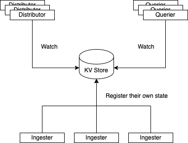

# Clustering

### Overview

Ingester and Distributors are clustered as mentioned in the previous chapter.

How do they achieve that?

### Architecture

Here is the architecture for an example, which is the ingester cluster.

Ingesters register their own state to centralized KV store according to their lifecycles.

Distributors and Queriers watch the KV store to get the state information of ingesters.

We can check the cluster status by accessing `/ring` endpoints in distributors or queriers.

#### How to join the cluster

An ingester will generate its own token and register its own state as JOINING to the KV store with it.

After a few seconds, it will check if its own token is duplicated in the cluster.

If duplicated, it will retry to generate token and register itself.

That's how it joins to the cluster.

Also, it will remove itself from the cluster when the shutdown.

### KVStore

We can use etcd or Consul as the KV store.

In addition, memberlist is available to use for that, which makes Ingesters(or Distributors) the distributed KV store cluster itself.


