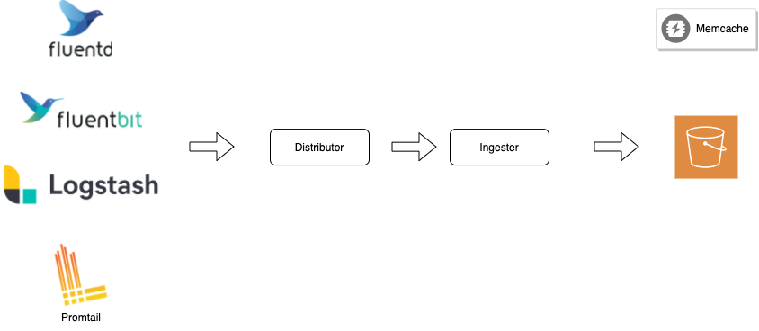

# Ingestion Process

### Overview

In this chapter, I'll introduce the ingestion process of Loki to you.

You can get the following understandings.

* The components to ingest
* Ingestion mechanism
* Log chunk buffering & flushing
* Write-Ahead Log mechanism
* Unordered logs and Orderered logs

### Components for ingestion

Here are the components to ingest logs.

Fluentd, Fluentd Bit, Logstash, and Promtail are the clients for Loki, and Distributor and Ingester are Loki's components.

In addition, AWS S3 is a chunk and index storage and Memcache is a cache layer for them.

Let me introduce them in order.

#### Clients for Loki

These components collect logs from your applications and send them to Loki via Distributor's HTTP endpoint.

#### Distributor

This component has the responsibility to validate the ingestion requests and distribute them to appropriate ingesters according to the consistent-hash algorithm.

#### Ingester

This component has the responsibility to buffer logs on memory temporally and post logs to the storage engine like S3 and cache them to the chunk cache like Memcache or Redis.

#### AWS S3 as Storage Engine

The logs are stored here persistently.

This layer also supports Cassandra, GCS, DynamoDB, and the other products.

Here are the supported storage products.

[Supported Stores](https://grafana.com/docs/loki/latest/operations/storage/)

#### Memcached as Cache

It is an optional component but very effective for query performance.

There are four types of cache in Loki.

You can know more details about it.


[cache-strategy.md](../cache-strategy.md)


### Write Path

Write path overview is the listed.

1. The client sends logs to Loki's distributor
2. The distributor validates the post request and routes it to appropriate ingesters
3. The ingester validates the request
4. The ingester write it on WAL and buffers it into a memory chunk
5. The ingester flush the memory chunks to AWS S3

In further sections, let's dive into more detailed mechanisms.
