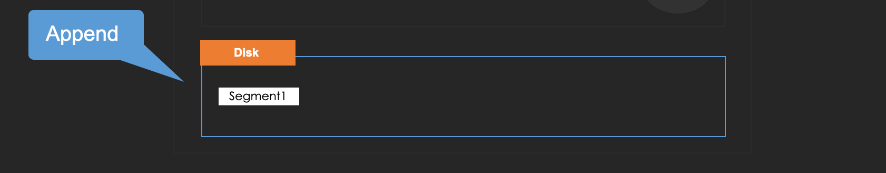

# Write-Ahead Log

Some people are curious about what happens to the logs if an ingester dies before they are completely flushed. Write-Ahead log addresses for such a situation.

Here are the features of WAL.

* Written in ingester's disk space when it receives post requests.
* Not stop the ingestion flow, unlike typical WAL
* Run recovery process when an ingester starts
* Purge unused WAL files periodically

There are two important files, which are "segment" and "checkpoint".

### Segment files

#### 1. A "segment" file is created and WAL is appended to it, with **raw data**

#### 2. A new segment file is created when its size reaches the limit

### Checkpoints

WAL mechanism purges segment files periodically and there is a goroutine for that.

A checkpoint file is created when the process runs.

#### 1. Force to advance to a new segment file to start purge process

So that the older segment file won't be written anymore and the writing segment file won't be deleted.

.png>)

#### 2. A checkpoint file is created based on the streams on memory.&#x20;

It means that "checkpoint" is a snapshot of memory chunks at that time and it is compressed as well. (but "head" elements are not compressed either)

#### 3. Purge unused files

It deletes the files without the newest segment and checkpoint.

That's how the snapshot of unflushed chunks on memory at that time remains.

### How to recover from WAL

The recovery process is called in starting process of an ingester.

Before the ingester is ready, it loads the logs from segments and checkpoints and then pushes them to the memory chunks.

After that, they are managed as well as normal memory chunks.

**In addition, if the recovery process is failed, the starting process will be failed as well.**

That's how Loki recovers the unflushed logs from WAL.

