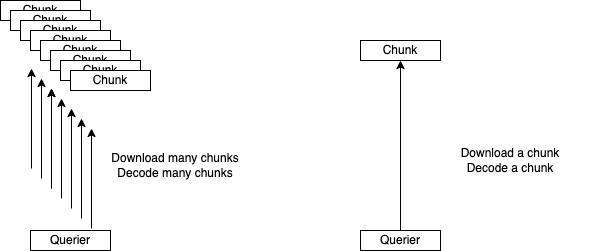

# Performance Improvement

### Overview

In this section, I'll show you the tips to improve Loki's performance in my environment, 20 TB / day.

Basically, splitting a query, increasing querier instances, and increasing chunk size are the ways to improve performance but there are some points to consider.

### Increasing chunk size

A way what we can try at first to improve query performance is increasing a chunk size.

Smaller chunks make us download more chunks to select logs.

It means that too many network communications happen and more decoding time for each chunk is needed due to compression.

Increasing target chunk size enables us to reduce the network communications and decoding time.

In addition, overall of the compression rate of chunks will be improved because the metadata in chunks is reduced.

#### Better to use Redis

However, memcached doesn't like to receive logs that are more than 500KiB.

In fact, I got many errors about putting chunks to it in my environment when the target chunk size is 1MiB.

Alternatively, I introduced Redis for chunk cache and the target chunk size is now 5MiB.

It caused dramatic performance improvement.

#### Consider some parameters

There are some very important parameters to determine the flush time.

They are `max_chunk_age` and `chunk_idle_period.`

Chunk reaches `max_chunk_age` or `chunk_idle_period` or `chunk_target_size` and then it is enqueued in a flush queue as this graph shows.

The flush without reaching `chunk_target_size` makes chunks smaller.

Therefore, even if we increase the `chunk_target_size`, it can't help to improve unless `max_chunk_age` and `chunk_idle_period` are enough.

In addition, too many labels make chunks being split too much so chunk size less likely to reach `chunk_target_size`.

That's why we need to consider label cardinality and these parameters with `chunk_target_size.`

### Unbalanced traffic to specific streams

Distributors route streams to appropriate ingester instances by consistent-hash-algorithm.

It works fine and the streams are routed roughly evenly.

However, there was the case, where only specific streams have large amounts of logs.

It means that the streams are balanced evenly but traffic to append logs was unbalanced and too much access to specific instances happened so the ingesters were too busy and bottlenecked.

However, I didn't like to increase all of the ingesters' resources.

I split the streams by adding a few labels in them so that they are split and the traffic was routed evenly as a workaround.

### Improving long time range query

Queriers use the iterator pattern to select logs so it can stop loading when the result reaches the target size.&#x20;

Therefore, the queries for searching the many logs which are generated in a short time are very fast even if the query time range is long because queriers can stop loading in progress.

However, the queries that time-range is long and logs to be matched are few tend to be slow because Loki must search for the longer time range.

How should I address this issue?

One way is to split a query by appropriate time range for processing in a querier.

Also, we can scale up and out the queriers.

Anyway, it is important to process queries in parallel that are not too long or too short for a single querier.
