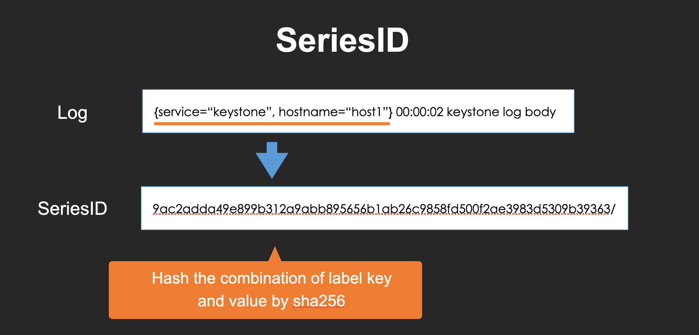

# Select the chunks by inverted index

### Overview

After querying for all of the ingesters, a querier tries to select flushed chunks using inverted indexes. And then, the chunks are filtered and returned to the query-frontend.

### What is "inverted index"?  Why does Loki use it?

"Inverted index" is also used in full-text search engines like Elasticsearch.

This is the data structure, which aims to search logs based on label values efficiently.

In Loki, the log chunks have unique IDs to identify.

The inverted index has the mapping between label key-values and chunk IDs so that we can select the chunks with label keys or values in performant.&#x20;

If Loki doesn't use it, it would spend a lot of time retrieving large amount of logs.

### The structure of the inverted index

To understand the structure, we need to know "series-id" and "chunk-key".

#### Series ID

Series-id is the id of a stream.

The series-id is constructed with the hash value of label name and value pairs.



#### Chunk Key

Chunk-key is the unique key of a chunk.

The chunk key is constructed with the tenant-id, the hash value of label key and value pairs, chunk created time, and chunk closed time.


#### Inverted Index

Inverted index is managed as a table like DynamoDB.&#x20;

Also, there are some kinds of tables and they are to identify series-ids and chunk keys.

At first, here is the table definition to identify series-ids by label names or label values.

.png>)

It has three columns and its row is unique with "hash value" and "range value" columns as well as DynamoDB.

We can search with a prefix of the range value and sort the results with it.

An actual table example helps us to understand.


There are all of the mappings between each stream-id and each label key-value pair.

For example, the stream-ids which have "service=keystone" in their labels like "{service=keystone, hostname=host1}" and "{service=keystone, hostname=host2}" are recorded with "service" hash value and "keystone" value.

It means that high cardinality labels cause too many rows and decreases performance.

Second, here is the table to identify chunk-keys by series-ids.


It can be scanned with series-ids, tenant-ids, and time range to get chunk keys.

### How to use these structures to select logs

Let's look at an example to understand.

We can query this LogQL to select the logs, which have "keystone" as the service, "host1" as the hostname, and are error level.

```
{service="keystone", hostname="host1"} |= "level=ERROR"
```

How does a querier process it?

At first, the querier splits the query with labels and filter expressions, and then it uses only labels to search logs using the inverted indexes.


Second, it splits label pairs and retrieves the matched stream-ids for each pair.


In this case, it scans the table to get matched stream-ids with "service=keystone" or "hostname=host1".

It searches the rows which have "service" in "hash value", hashed "keystone" in "range value", and "keystone" in "value" column.

On the other hand, it also searches the rows which have "hostname" in "hash value", hashed "host1" in "range value", and "host1" in "value" column in parallel.

Of course, the index cache is scanned at first and if not found, BoltDB is called and the results will be cached.


The result series-ids for "service=keystone" are "c79abadeff" and "bffjk12ass".

On the other hand, the result for "hostname=host1" are "c79abadeff" and "vk1abadeff".

The querier remains only the stream-id in both results so "c79abadeff" is the final answer here.


The series-id is used to select chunk keys.

Here is an example to match the series-id "c79abadeff" and 5 min after 2021/10/26 21:52.


In this case, "chunk1" is the target chunk key.

That's how the querier gathers the matched chunk keys for the given query.

### How to collaborate with query-sharding

In the previous section, I mentioned query-sharding, which split a query into some queries by shard number. How does Loki use the shard number?

A query will be automatically split by the shard number in query-frontend.

Therefore, when a querier receives a query request, it knows the shard number.

In addition, the inverted index table actually has the shard number in "range value" column so that the querier can get the series-ids that are split by that.


That's how we can process a query in parallel.
